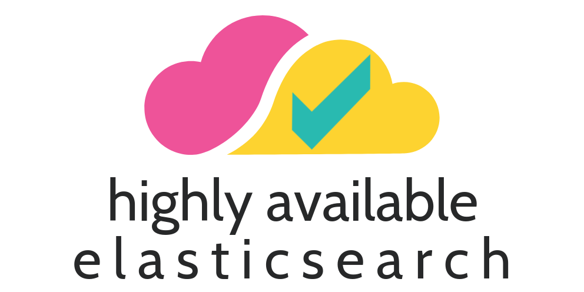

  

badgeMadeWith badgeBestPractices?

---

SCREENSHOT OF SOLUTION

*Description of screenshot*

    

[Features](#-features) | [Solution Architecture](#-solution-architecture) | [Getting Started](#-getting-started) | [Configuration](#-configuration) | [Maintenance Steps](#-maintenance-steps) | [Author](#-author) | [Credits](#-credits) | [Failures](#-failures)

## 🎯 Features

• **Elasticsearch cluster in Kubernetes cluster:** At this project elasticsearch cluster is in the kubernetes cluster to ... It is only needed a kubeconfig file to use the remaining k8s cluster.

• **Deployed via Helm:** Helm is used to deploy the kubernetes cluster. It could be deployed using ... and ... but helm has advantage to ...

• **Highly available:** The elasticsearch cluster has high availability due to ...

• **Same roles:** The roles assigned to each of the elasticsearch nodes are all identical.

• **Downloadable:** The solution can be downloaded by cloning the project or downloading the zip file under Releases

• **Well documented:** All phases of the solution are documented and this README-driven project...

• **Easy appliable:** When all of the steps are completed successfully, one may own an elasticsearch cluster...

## 📐 Solution Architecture

## 🚀 Getting Started

## ⚙️ Configuration

## 👣 Maintenance Steps

## 🙋‍♂️ Author

Mustafa Can Sevinç

   

## 📚 Credits/Resources

* https://tom.preston-werner.com/2010/08/23/readme-driven-development.html
* https://github.com/alexandresanlim/Badges4-README.md-Profile

## 🍐 Failures