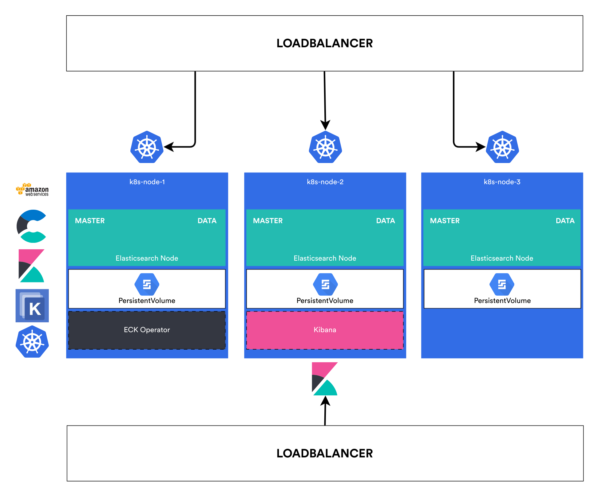

<div align="center">

[](highly-available-elasticsearch)

[](https://github.com/mustafacansevinc/highly-available-elasticsearch/releases) [](./LICENSE) [](https://github.com/mustafacansevinc/highly-available-elasticsearch/) 

[Features](#-features) | [Solution Architecture](#-solution-architecture) | [The Solution](#-the-solution) | [Quick Start](#-quick-start) | [Author](#%EF%B8%8F-author) | [Credits](#-credits) | [Failures](#-failures)

    

</div>

---

Highly Available Elasticsearch solution is designed to help out the team to execute (near) real-time queries and visualize the free form reviews that the customers fill out after each delivery.

The [Solution Architecture](#-solution-architecture) section contains **detailed** information about the configured and unconfigured values, and describes the background of them. So it is **not necessary to read** that section to deploy the *Highly Available Elasticsearch* solution.

You can check out [The Solution](#-the-solution) section to flick through the configuration values and the reasons of the configuration or just jump to the [Quick Start](#-quick-start) section to deploy the solution.

I can say that I have spent more than 25 hours to write this document including researches, 2 hours for trying the solution, and a couple of hours to think about the ways to increase the resilience. Also I have spent some time at my [failures](#-failures) too.


## 🎯 Features

• **Elasticsearch cluster in Kubernetes cluster:** At this project elasticsearch cluster is deployed in the kubernetes cluster with the help of ECK, to simplify and speed up the deployment and updates. It is only needed a kubeconfig file to use the remaining k8s cluster.

• **Highly available:** The elasticsearch cluster is configured carefully to ensure it has high availability and the cluster is resilient to single-node failures. Also created automated snapshots to ensure the data may be restored.

• **Same roles:** The roles assigned to each of the elasticsearch nodes are all identical as the cluster is deployed with a single NodeSet definiton with a count of 3.

• **Downloadable:** The solution can be downloaded by cloning the project or downloading the zip file under [releases](https://github.com/mustafacansevinc/highly-available-elasticsearch/releases).

• **Well documented:** Whole architecture and details of the solution are documented in this README-driven project. This documentation which simplifies the complicated things, surely helps understanding Elasticsearch, and by that, it helps designing a resilient cluster.

• **Deployed via Kustomize:** Kustomize is used to manage kubernetes workloads and to generate an output file which will be used to deploy highly available elasticsearch on the kubernetes cluster.

• **Easy appliable:** When all of the steps are completed successfully, an elasticsearch cluster will be deployed and ready.


## 📐 Solution Architecture

Elasticsearch is a distributed, search and analytics engine which gives the near real-time search experience and analysis of data.

It is fast, distributed and capable of handling the volume and fre-form nature of data, scalabe and resilient.

An elasticsearch cluster can be spawn quickly to use on AWS, but the optimization of the cluster will be cruical to improve the speed and sustainability. There are gigabytes of data coming in all the time and the data has to be easily accessible and the cluster has to be resilient. Elasticsearch works even with an unoptimized configuration, but as there are more data, there will be more errors to encounter.

It is not that easy to run an elasticsearch cluster in **production**. It is always better to take time while building your cluster. You need to understand what your requirements are and what you want before building your cluster. And keep tuning the configuration as you encounter errors, until the cluster will become stable.

This solution will be focused on the resilience of the elasticsearch cluster and the design.

### 💪 Resilience

Sometimes the cluster may experience hardware failure or a power loss. The cluster will be resilient to the loss of *any node* as long as:

* The cluster health status is **green**.
* There are at least **two data nodes**.
* Every index that is not a searchable snapshot index has **at least one replica of each shard**, in addition to the primary.
* The cluster has at least **three *master-eligible* nodes**, as long as at least two of these nodes are not voting-only *master-eligible* nodes.
* Clients are configured to send their requests to a **load balancer** that balances the requests across an appropriate set of nodes.

Some features are offered by Elasticsearch to keep the cluster highly available. 

* [Cross Cluster Replication](https://www.elastic.co/guide/en/elasticsearch/reference/current/xpack-ccr.html): It lets you replicate index and the data across remote follower clusters which may be in a different datazone from the leader cluster so that search request can be still handled during the datacenter outage:
    * In uni-directional configuration, there is one cluster to contain only leader indices and the other cluster to contain only follower indices. It can be applied the architectures:
        * Single disaster recovery datacenter
        * Multiple disaster recovery datacenter
        * Chained replication
    * In bi-directional configuration, each cluster contains both leader and follower indices.
        * Bi-directional replication
    * Please note that CCR is not covered in this solution as high availability should be provided using only one cluster.

* [**Taking regular snapshots**](https://www.elastic.co/guide/en/elasticsearch/reference/current/snapshots-take-snapshot.html): So that you can restore a fresh copy of your data.
    * The snapshot creation and retention process could be automated using [Snapshot Lifecycle Management](https://www.elastic.co/guide/en/elasticsearch/reference/current/snapshot-lifecycle-management-api.html) (SLM).
    * If multiple SLM policies are defined to create snapshots at different time intervals, it lets you restore data from a wider range.
    * The snapshots can be stored in file system location or in custom repositories like S3, Azure & Google Cloud Storage. See [this link](https://www.elastic.co/guide/en/cloud/current/ec-custom-repository.html) for details.
    * Periodic snapshots can be taken with also a [CronJob](https://kubernetes.io/docs/concepts/workloads/controllers/cron-jobs/)

* [**Design for resilience**](https://www.elastic.co/guide/en/elasticsearch/reference/current/high-availability-cluster-design.html): The main step of high availability is the design for resilience as an Elasticsearch cluster can continue operations as normal if some of its nodes or components are unavailable when there are enough well-connected nodes with a proper design.
    * One node clusters: A single node cluster *cannot be resilient* as there are no replicas. It is needed to override the `number_of_replicas` value as 0 to ensure the cluster can report a `green` status. A snapshot may be restored if the node fails. One-node clusters are not recommended to use in production.
    * Two-node clusters: A two-node cluster *cannot be resilient*. The master elections are majority-based, so one of the nodes should be configured as `node.master: false` to ensure it is *master-ineligible*, as if the both of the nodes were *master-eligible* the master election will fail. With this type of design, the cluster may tolerate the loss of the *master-ineligible* node. Also, a resilient load balancer should be configured to balance client requests across the nodes.
    * **Three-node clusters**: All three nodes can have the same roles in this scenario and as they all are *master-eligible*, the cluster will be resilient to the loss of any single node. Also, a resilient load balancer should be configured to balance client requests across the nodes.
    * Clusters with more than three nodes: It is good practice to limit the number of *master-eligible* nodes to three, which will shorten the time of master elections. But as the cluster is larger, it is recommended to use dedicated nodes for each role to scale resources for each task independently. Also, you should avoid sending any client requests to the dedicated *master-eligible* nodes to overwhelm them with unnecessary extra work that could be handled by one of the other nodes.
    * Multizone clusters: [Resilience in larger clusters](https://www.elastic.co/guide/en/elasticsearch/reference/current/high-availability-cluster-design-large-clusters.html)

### 🎭 Roles

The most-used node roles are:

* **`master`**: Every cluster requires this role.
* **`data`** **or** `data_content` & `data_hot`: Is required by every cluster.
* `ingest`: Required if stack monitoring & ingest pipelines are used.
* `remote_cluster_client`: Required if cross-cluster search/replication is used.
* `transform`: Required if if fleet, elastic security or transforms used.
* `ml`: Required if using machine learning features, such as anomaly detection. `xpack.ml.enabled` may be set as `false` to disable the machine learning API on the node.

### 💎 Sharding

In Elasticseach, the data is organized in indexes and each index is divided into shards that are distributed across multiple nodes.

Elasticsearch is [based on](https://www.elastic.co/celebrating-lucene) Apache Lucene. [Lucene Index](https://lucene.apache.org/core/9_0_0/core/org/apache/lucene/codecs/lucene90/package-summary.html) is made of little segments of files located on your disk. Whenever you write, a new segment will be created. When a certain amount of segments is reached, they are all merged. Whenever you need to query your data, each segment is searched.

So shards are created when a new document needs to be indexed, then a unique id is being generated and the destination of the shard is calculated based on this id.

Once the shard has been delegated to a specific node, each write is sent to the node.

This method allows a reasonably smooth distribution of documents across all of your shards. This will distribute your documents pretty well across all of your shards so you can quickly query lots of documents.

Searches run on a single thread per shard, so searches across lots of shards will cause slow search speeds as different shards has to be queried to collect the information.

Also, each index and shard requires some memory and CPU resources. Usually a small set of large shards uses fewer resources than many small shards.

Elasticsearch will balance shards automatically. When a node has been added or a node has fails, Elasticsearch rebalances the index's shards across the remaining nodes. The time to rebalance the cluster increases as the shard size increases.

Also [replication of the shards](https://www.elastic.co/guide/en/elasticsearch/reference/current/docs-replication.html) to other nodes ensures that you always have the data even if you lose some nodes.

So, the optimal shard size or count will be between these extreme values, usually. And the best way is to run benchmarks using near-real data and queries.

On the older versions of Elasticsearch it was recommended to calculate the number and size of shards.

But now, with the newer versions, the best way to prevent oversharding and other shard-related issues is to create a sharding strategy to help you determine and maintain the optimal number of shards for your cluster while limiting the size of those shards.

And as there isn't any strategy which fits every cluster, a good sharding strategy must account for your infrastructure, use case, and performance expectations. [Quantitative cluster sizing webinar](https://www.elastic.co/elasticon/conf/2016/sf/quantitative-cluster-sizing) explains the recommended methodology to create a sharding strategy.

When building the sharding strategy, consider what explained detailly previously.

Kibana has the required tools to [monitor elasticsearch](https://www.elastic.co/guide/en/elasticsearch/reference/7.16/monitor-elasticsearch-cluster.html), which should be used as different shard configurations are tested.

<div align="center">


*Cluster's stability and performance can be tracked with Kibana*

</div>

Don't forget to:
* Aim for shard sizes between 10GB and 50 GB: This is not a hard limit but it is the best size for logs and time series data. If [Index Lifecycle Management](https://www.elastic.co/guide/en/elasticsearch/reference/current/index-lifecycle-management.html) (ILM) is used, [set `max_primary_shard_size` threshold](https://www.elastic.co/guide/en/elasticsearch/reference/current/ilm-rollover.html#ilm-rollover-primar-shardsize-ex) to `50gb` to avoid shards larger than 50GB.
* Aim for 20 shards or fewer per GB of heap memory. Check the [number of shards per node](https://www.elastic.co/guide/en/elasticsearch/reference/current/cat-shards.html) and check [current size of each node's heap](https://www.elastic.co/guide/en/elasticsearch/reference/current/cat-shards.html), if you find they exceed more than 20 shards per GB, add another node.
* Prevent node hotspots, by updating [`index.routing.allocation.total_shards_per_node`](https://www.elastic.co/guide/en/elasticsearch/reference/current/allocation-total-shards.html#total-shards-per-node) setting.
* Avoid unnecessary mapped fields, by using [explicit mapping](https://www.elastic.co/guide/en/elasticsearch/reference/current/explicit-mapping.html) instead of [dynamic mapping](https://www.elastic.co/guide/en/elasticsearch/reference/current/dynamic-field-mapping.html) to avoid creating fields which consumes disk and memory but are never used.

### 💾 Storage

The storage mechanism for Elasticsearch data has to be configured to work on Kubernetes, as any Kubernetes storage option. It is recommended to use [PersistentVolumes](https://kubernetes.io/docs/concepts/storage/persistent-volumes/), by creating a [VolumeClaimTemplate](https://www.elastic.co/guide/en/cloud-on-k8s/current/k8s-volume-claim-templates.html) with the desired storage capacity and [StorageClass](https://kubernetes.io/docs/concepts/storage/storage-classes/) to associate with the PersistentVolume.

There are two types of PersistentVolumes which are both handled the same way, but their performance differs:

* **Network-attached PersistentVolumes** which provides a huge **benefit**. When the host goes down, or needs to be replaced, the Pod can simply be deleted. Kubernetes reschedules it automatically on a different host and reattaches the same volume, very quick and without any human intervention.
* **Local PersistentVolumes** which provides a huge **overhead**. When the host goes down, or needs to be replaced, the Pod cannot be scheduled on a different host. Once a Local PersistentVolume is bound to it, the Pod can only be scheduled on the same host. It remains in `Pending` state until the host is available, or until the PersistentVolumeClaim is manually deleted. So Local PersistentVolumes come with some operational overhead.

**Operations of Local PersistentVolumes**

* **Host Maintenance:** When a host is out of the Kubernetes cluster temporarily, it is common to cordon, then drain it. Depending on the [PodDisruptionBudget](https://www.elastic.co/guide/en/cloud-on-k8s/1.9/k8s-pod-disruption-budget.html), the pods on that host will be deleted automatically. The pod will stay on `Pending` state and cannot be scheduled again on the cordoned host till the host gets online. The next pod will be deleted automatically as soon as the Elasticsearch cluster health becomes green again.
* **Host Removal** If a host has a failure or is permanently removed, its local data is likely lost. The pod will stay `Pending` and it cannot attach the PersistenVolume any more. The schedule the pod on a different host, **with an empty volume**, you have to manually remove both the PersistentVolumeClaim and the Pod. Then a new pod will be created with a new PersistentVolumeClaim which is then matched with a PersistentVolume. Finally, Elasticsearch [shard replication](https://www.elastic.co/guide/en/elasticsearch/reference/current/docs-replication.html) makes sure that data is recovered on the new instance.

**volumeBindingMode: WaitForFirstConsumeredit** is set to let the pod which scheduled on a host access the existing PersistenVolume.

**Reclaim Policy:** PersistentVolumeClaims are deleted automatically by ECK when they are not needed any more. As the PersistentVolume with existing data cannot be reused, **it is recommended to `Delete`**, as default, instead of `Retain`

### 🧮 Memory & JVM Heap Size

On the [**older versions** of Elasticsearch](https://www.elastic.co/guide/en/elasticsearch/reference/6.8/heap-size.html) it was a must to override the JVM options as Elasticsearch was shipped with a default heap size of 1 GB.

But with the newer versions, **it is not recommended to modify advanced settings** as it will negatively impact performance and stability. By default, **Elasticsearch automatically sets the JVM heap size** based on the node's roles and total memory.

The heap size still can be overridden, by the [following rules](https://www.elastic.co/guide/en/elasticsearch/reference/7.16/advanced-configuration.html#set-jvm-heap-size):

* `Xms` and `Xmx` should be set to no more than 50% of the total available RAM. Where the total memory is defined as the amount of memory visible to the container, if Elasticsearch is running in a container. Not the total system memory on the host.
* Also ideally, they should be less than 26GB because that is the point at which object pointers are not zero based anymore and it will drop the performance.

The heap size can be configured by defining the `ES_JAVA_OPTS` variable as `-Xms8g -Xmx8g`

**Note:** When running Elasticsearch on ECK, by default, ECK applies a memory resource limit of 2 GiB to the container. Its recommended to configure the resources in the manifest file.

### 🥽 Virtual Memory

Elasticsearch uses memory mapping (mmap) by default. The default values for virtual address space on Linux distros are too low for Elasticsearch to work properly, and that may lead to *out-of-memory exceptions*. For production, it is strongly recommended to increase the `vm.max_map_count` setting of kernel to `262144`.

### 🛠️ Applying Custom Configuration

There are [two options](https://www.elastic.co/guide/en/cloud-on-k8s/current/k8s-bundles-plugins.html) to run Elasticsearch with custom configuration files and specific plugins installed. They are:

1. Create custom Image: Requires a container registry
2. Use init containers: Each node needs to download seperatly wasting bandwith

### 📈 Benchmark

[Rally](https://github.com/elastic/rally) will be used to benchmark the solution and to [size the cluster correctly](https://www.elastic.co/webinars/using-rally-to-get-your-elasticsearch-cluster-size-right) (see [Failures](#-failures)).


## 💡 The Solution

The elasticsearch cluster is configured to ensure high availability and resilience to the loss of any single node.

* ECK will be deployed using vanilla manifest files.
* The Elasticsearch cluster and Kibana will be deployed using **kustomize**-generated file.
* The desired configuration will be applied by initContainers because building a registry is not a part of this solution.

<div align="center">



*The diagram of solution*

</div>

* The design will be three nodes which have the same roles which are **master & data** because we don't need other roles. If an [Ingest Pipeline](https://www.elastic.co/guide/en/elasticsearch/reference/current/ingest.html) will be created, `ingest` role may be given to all nodes, too.
* A **load balancer** will be configured to balance client requests across the nodes.
* Total shards per node **won't be hard-limited** as it can result in some shards not being allocated.
* This solution will go with **dynamic mapping** option to define the document & how its stored. If any example data was provided, this solution would go with explicit mapping and prevent unnecessary mapped fields.
* **AWSElasticBlockStore** is used, by defining aws-ebs StorageClass, to benefit from the rescheduling behavior of network-attached PersistentVolumes.
* A [SLM policy](https://www.elastic.co/guide/en/cloud-on-k8s/current/k8s-snapshots.html) will be defined to back up indices automatically by taking snapshots regularly. The snapshots will be stored in file system location as there is no S3 provided: (see [Failures](#-failures))
* The **default JVM heap size** settings are used, as it's recommended, instead of overriding the heap size. But limited the resources by specifying memory and cpu on the manifest file.
* Update strategy will stay as [the default behavior](https://www.elastic.co/guide/en/cloud-on-k8s/current/k8s-update-strategy.html) as unlimited maxSurge and only **1 unavailable pod at one time**.
* Default [PodDisruptionBudget](https://www.elastic.co/guide/en/cloud-on-k8s/current/k8s-pod-disruption-budget.html) configuration is used. It allows **one Elasticsearch Pod to be taken down**, as long as the cluster has a green health.
* [Node scheduling](https://www.elastic.co/guide/en/cloud-on-k8s/current/k8s-advanced-node-scheduling.html) will remain default as **Single Elasticsearch node per Kubernetes host**
* Default [Readiness probe](https://www.elastic.co/guide/en/cloud-on-k8s/current/k8s-readiness.html) configuration is used. It will be sufficient as we don't expect heavy load.
* Default [PreStop hook](https://www.elastic.co/guide/en/cloud-on-k8s/current/k8s-prestop.html) configuration is used for pods. ECK will wait for an **additional 50 seconds** when the pod is terminated, to avoid the race condition.
* Default [security context](https://www.elastic.co/guide/en/cloud-on-k8s/current/k8s-security-context.html) configuration is used and Elasticsearch **runs as root**.

## 🚀 Quick Start

### 📑 Prerequisites

* Kubernetes 1.18-1.23
* Kustomize 4.3.0
* Access to an EKS cluster

### 🪄 Installation

Install ECK Custom Resources v1.9.1

```bash
kubectl create -f eck/eck-crds.yaml
```

Install ECK Operator v1.9.1

```bash
kubectl apply -f eck/eck-operator.yaml
```

Monitor the operator logs:

```bash
kubectl -n elastic-system logs -f statefulset.apps/elastic-operator
```

Create elasticsearch & kibana deployments v7.16.1 by building with kustomize and then deploy them.

```bash
kustomize build k8s -o k8s.yaml
kubectl apply -f k8s.yaml
```

Watch until the pods are ready and then check status of cluster. This may take a couple of minutes.

```bash
watch kubectl get pods -n elastic-ha

kubectl get elasticsearch -n elastic-ha

kubectl get kibana -n elastic-ha
```

Get the external ip and port of elasticsearch loadbalancer:

```bash
kubectl get svc -n elastic-ha | grep ha-es-http
```

Get the password of elastic user

```bash
kubectl -n elastic-ha get secret ha-es-elastic-user -o go-template='{{.data.elastic | base64decode}}'
```

Visit https://{EXTERNAL-IP}:{PORT} from browser. You will get a **"Your connection is not private"** error.

Click **Advanced** and click **Proceed to {EXTERNAL-IP} (unsafe)**

Login with `elastic` user and the password which you copied on the previous step.

You should get a screen like this:


Kibana is configured and ready-to-use too. But to visit Kibana, the 5601 ports of the EC2 Instances should be configured. To verify that kibana is ready, you can send a `curl` request from elasticsearch pod.

```bash
kubectl -n elastic-ha exec -ti ha-es-default-0 bash

curl -X GET "https://ha-es-kibana-kb-http:5601/login" -k -I
```

You should get a response like this:


## 🙋‍♂️ Author

<samp><strong>Mustafa Can Sevinç #Enthusiastic #Diligent #DevOps #Cloud #Engineer</strong></samp>

[](https://github.com/mustafacansevinc) [](https://www.linkedin.com/in/mcansevinc/) [](mailto:mcansevinc@gmail.com) [](http://cansevinc.com.tr/)

> *"A smooth sea never made a skilled sailor."*

I do love challenges.

I have worked on many kinds of products, mostly on building **private cloud systems for defence industry** and developing on them. Those systems were highly available, scalable, fault-tolerant clusters with massive storage capacities.


In my work time, I do

* ⚙️ Automate things,
* 🧩 Provision servers & services,
* 🐋 Modernize applications,
* 📊 Visualize data,
* ☁️ Check out new technologies...

Also I assure
* ♻️ Maintainable code,
* 🗃️ Documentation of failures and successes,
* 🗣️ Attention to feedbacks.

I am taking a course right now *to be AWS-Certified* and enhance my toolkit with AWS services.

## 📚 Credits

* https://tom.preston-werner.com/2010/08/23/readme-driven-development.html
* https://github.com/alexandresanlim/Badges4-README.md-Profile
* https://www.elastic.co/guide/en/cloud-on-k8s/1.9/k8s-volume-claim-templates.html
* https://www.ashnik.com/how-to-configure-highly-available-elasticsearch/
* https://dzone.com/articles/apache-lucene-a-high-performance-and-full-featured
* https://www.cncf.io/blog/2021/03/25/how-to-build-an-elastic-search-cluster-for-production/
* https://www.elastic.co/blog/how-many-shards-should-i-have-in-my-elasticsearch-cluster
* https://www.elastic.co/guide/en/cloud/current/ec-custom-repository.html
* https://www.elastic.co/guide/en/elasticsearch/reference/current/snapshot-lifecycle-management-api.html
* https://www.elastic.co/guide/en/elasticsearch/reference/7.16/monitoring-overview.html
* https://www.elastic.co/guide/en/cloud-on-k8s/current/k8s-persistent-storage.html
* https://portworx.com/wp-content/uploads/2020/02/Experts-Guide-Running-Elastic-on-Kubernetes-Portworx.pdf
* https://opster.com/blogs/elasticsearch-best-practices-3000-cluster-analysis/
* https://medium.com/99dotco/a-detail-guide-to-deploying-elasticsearch-on-elastic-cloud-on-kubernetes-eck-31808ac60466
* https://portworx.com/blog/how-to-backup-and-restore-elasticsearch-on-kubernetes/
* https://joshua-robinson.medium.com/a-guide-to-elasticsearch-snapshots-565017630638
* https://learnk8s.io/production-best-practices
* https://kubernetes.io/docs/concepts/storage/storage-classes
* https://cloud.google.com/blog/products/containers-kubernetes/kubernetes-best-practices-resource-requests-and-limits
* https://www.youtube.com/watch?v=Wf6E3vkvEFM
* https://app.terrastruct.com/

## 🍐 Failures

* I have designed highly-available-elasticsearch to take automated snapshots. However, I couldn't manage to register a statically provisioned filesystem repo. So I couldn't add the CronJob or SLM Policy which are mentioned in [The Solution](#the-solution)
* I was going to benchmark the solution using [Rally](https://github.com/elastic/rally). But that is something that I couldn't make it on time.
